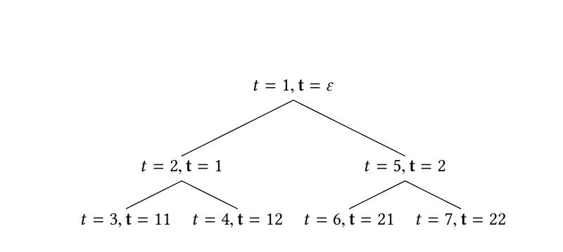
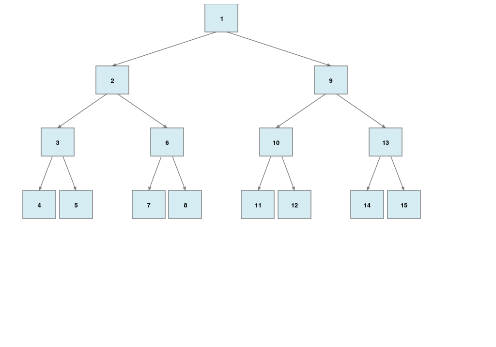

# Pixel: Forward secure Multi-signatures

1. Based on the paper [Pixel: Multi-signatures for Consensus](https://eprint.iacr.org/2019/514) 
2. Using [MIRACL's AMCL library](https://github.com/miracl/amcl).
3. Using BLS12-381 curve.
4. Contains the simple key update and fast forward update mechanism.

## Overview
Forward security is achieved by dividing time into periods and each time period has an associated signing key. 
Only signing keys of current time period and any necessary future time periods are kept.  
Signing keys are organized as nodes (both internal and leaves) of a full binary tree with the height of the tree being logarithmic to the maximum time period. 
So for supporting `T` time periods, a tree of depth `d` is created since the total number of nodes in this tree will be 2<sup>`d+1`</sup> - 1. In the paper as well as in code, `d+1` is denoted by `l`.
The tree is then traversed in pre-order (root then left then right) manner and nodes are assigned numbers corresponding to time periods. In the beginning, signing key is generated for the root but as time passes, 
signing key for children is generated by using a parent (immediate or grandparent) and keys for nodes earlier than the current time are removed.

     

Above is an example to support 7 time periods so `T` = 7. Each node is given a number denoted by *`t`* in italic font. The **`t`** in bold corresponds to the path from root to node 
where a 1 is appended to the path if node is on left of parent otherwise a 2 is appended. In beginning, key for `t` = 1 (root) is generated. When time passes 
to `t` = 2, key for node `t` = 2 is generated using the key for t=1 (root). Now key for t=1 needs to be removed. But it cannot be removed as only 
it can generate the key for node t=5 as t=5 has only 1 parent which is t=1. So key for t=5 is generated and then node for t=1 is removed.
In code, the t=2 and t=5 are called successors of node for t=1. 
When t=3, key for nodes t=3 and t=4 are generated and node for t=2 is removed. And so on.



Another example to support 15 time periods, so `T` = 15. Each node is given a number corresponding to the time period. In beginning key for node 1 (root) is generated.
Then when t=2, keys for node 2 and 9 are generated and node 1's key is removed. When t=3, key for node 2 is removed but only after generating keys for node 3 and 6. 
When t=4, keys for node 4 and 5 are generated since their parent node 3 needs to be removed. And so on.    
In fast forward case, i.e. signer wants to advance to a time period not immediately next. Say the signer has signing key for t=1. He now wants to advance to t=3. He will derive the keys for 
nodes 3, 6 and 9 (no need to derive key for node 2) and then remove key for node 1. 

## API
1. There is a `Sigkey` object denoting the signing key for a time period. A signer needs to maintain a bunch of signing keys. 
1. That is done through the `SigkeyManager` object. `SigkeyManager` is accompanied by a database object implementing the `SigKeyDb` interface. 
`SigkeyManager` keeps the current time period and `SigKeyDb` keeps the signing keys. For testing, `InMemorySigKeyDb` is given which implements
 `SigKeyDb` and keeps the keys in an in-memory hashmap. `SigkeyManager` has methods to update time by 1 or a fast forward update to any arbitrary time in future.
   - To advance to next time period, call `simple_update`. 
   - To advance to any arbitrary time in future, call `fast_forward_update`. 
   - To get current key call `get_current_key`.    
1. Call the `GeneratorSet::new` function to create the required number of generators
1. Once generators are created, call `Keypair::new` to create a new verification key, `SigkeyManager` with key for t=1 and the proof of possession.
1. Call `Keypair::verify_pop` to verify proof of possession. 
1. Call `Signature::new` to generate a in-deterministic signature on a message. This will lead to different signatures given the same secret key 
and same time period each time this method is called.
1. Call `Signature::new_deterministic` to generate a deterministic signature on a message. This will lead to the same signature given the same secret key 
and same time period no matter how many times this method is called.
1. Call `Signature::verify` to verify a signature.
1. Call `Verkey::aggregate` to aggregate verkeys.
1. Call `Signature::aggregate` to aggregate signatures.
1. Call `Signature::verify_aggregated` to verify an aggregated signature by passing all verkeys.
1. Call `Signature::verify` to verify aggregated signature if the verkey has already been aggregated.

## Benchmarking
There are tests which measure the time for signing and key update (both simple and fast forward). These 
tests have names prefixed with `timing`. Those tests use either a height of 15 or 19 (l=16 or l=20), so 
they support 65535 and 1048575 keys respectively. To run all of them, do
```
RUST_TEST_THREADS=1 cargo test --release -- --nocapture timing
```
This will time for various operations.
